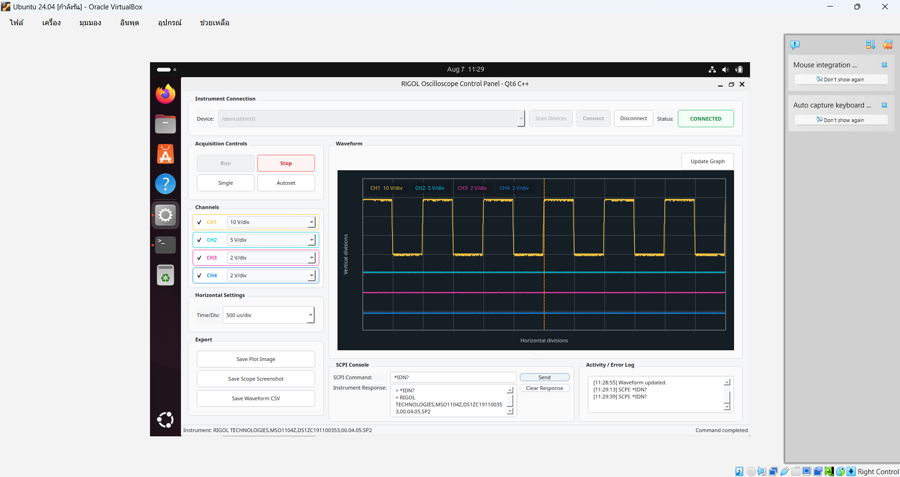
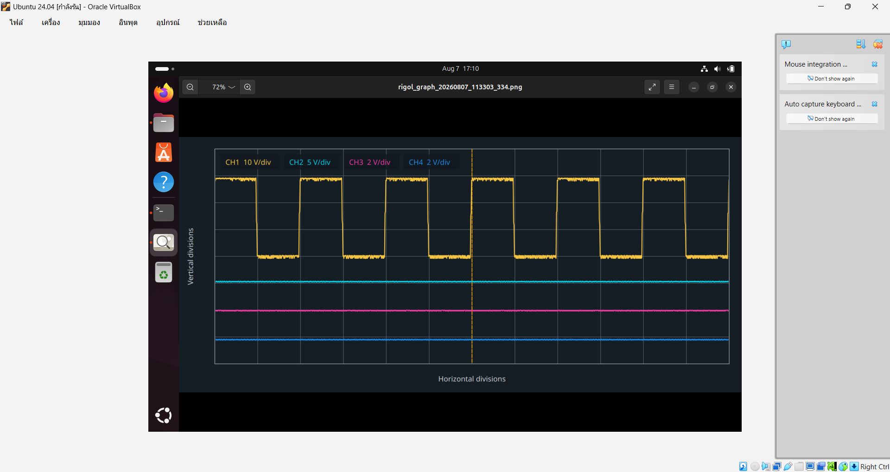
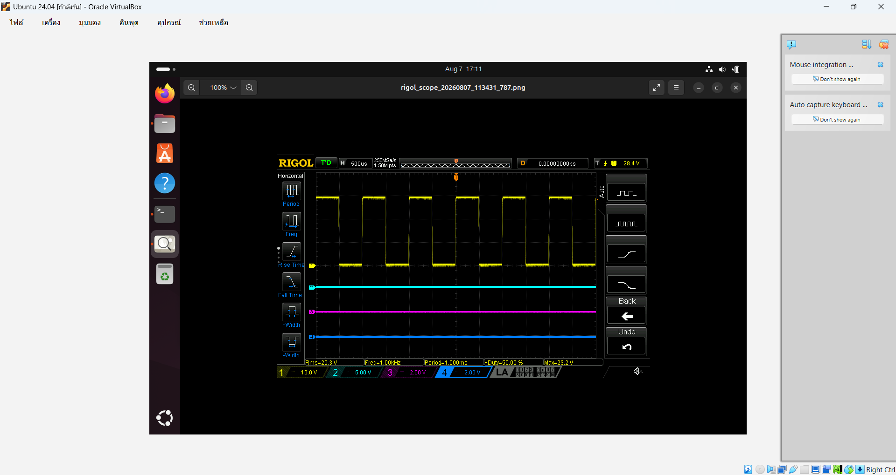
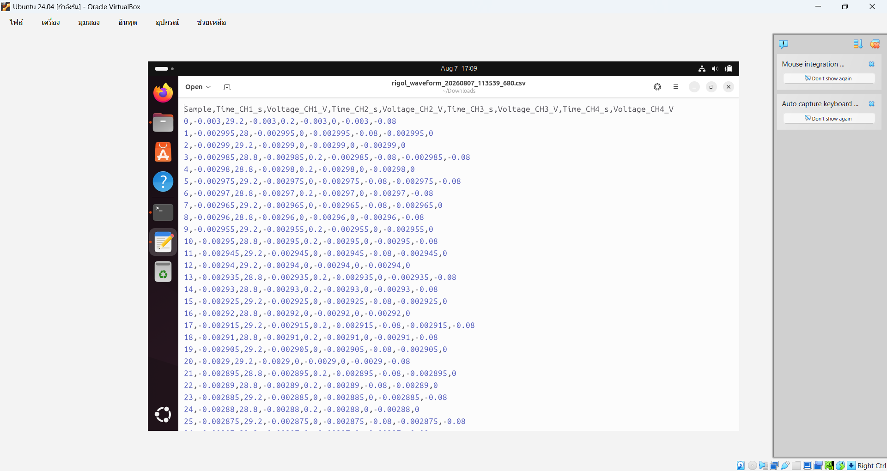

# C++/Qt6 RIGOL Oscilloscope Controller

A C++17/Qt6 desktop application for discovering, connecting to, and controlling a RIGOL oscilloscope through the Linux USBTMC driver. The application provides a compact interface for acquisition controls, channel and timebase settings, waveform viewing, SCPI communication, and data export.

## Objectives

- Build a practical Qt6 GUI for remote oscilloscope operation on Ubuntu.
- Communicate directly with a RIGOL oscilloscope by using Linux USBTMC and SCPI commands.
- Retrieve and display waveform data from multiple channels.
- Save plots, oscilloscope screenshots, and waveform samples for reports and further analysis.
- Apply object-oriented C++ to separate instrument communication, user-interface logic, and waveform rendering.

## Main Features

The features are organized into the same eight sections shown in the user interface.

### 1. Instrument Connection

Manages device discovery and the connection between the application and the oscilloscope.

- Scan for Linux USBTMC devices such as `/dev/usbtmc0`
- Select an oscilloscope from the detected device list
- Connect to or disconnect from the selected instrument
- Validate the selected device by sending `*IDN?`
- Display the connection status and instrument identification

### 2. SCPI Console

Provides direct communication with the oscilloscope through standard SCPI commands.

- Send manual SCPI commands and queries
- Display single-line or multi-line responses returned by the oscilloscope
- Clear previous instrument responses
- Keep SCPI responses separate from the activity and error log

### 3. Acquisition Controls

Provides the main controls for operating the oscilloscope acquisition state.

- Start continuous acquisition with **Run**
- Stop acquisition with **Stop**
- Capture one acquisition with **Single**
- Automatically configure the waveform with **Autoset**
- Synchronize the Run and Stop button states with the oscilloscope

### 4. Channels

Controls the display and vertical scale of each oscilloscope input channel.

- Enable or disable CH1-CH4
- Adjust the V/div value of each channel
- Synchronize channel settings after connecting or using Autoset
- Display each channel with its standard oscilloscope color

### 5. Horizontal Settings

Controls the horizontal time scale of the oscilloscope and waveform graph.

- Select the horizontal Time/Div setting
- Apply the selected time scale to the oscilloscope
- Update the graph divisions to match the selected timebase

### 6. Waveform

Retrieves waveform data from the oscilloscope and draws it inside the Qt application.

- Retrieve binary waveform samples from all enabled channels
- Convert raw samples into calibrated time and voltage values
- Display multiple channels on an oscilloscope-style 12 x 8 division grid
- Refresh the displayed data with **Update Graph**
- Preserve channel colors and scale information in the graph

### 7. Export

Saves oscilloscope results in formats suitable for reports and further analysis.

- Save the displayed graph as a PNG image
- Save the original oscilloscope screen as a PNG image
- Export calibrated waveform samples as a CSV file
- Record completed export operations in the activity log

### 8. Activity / Error Log

Displays program activities and errors separately from oscilloscope responses.

- Record device discovery, connection, acquisition, and waveform updates
- Display successful export operations and output paths
- Report USBTMC, SCPI, timeout, and waveform errors
- Show the current application state in the status bar

## Requirements

### Software

- **Operating system:** Ubuntu 24.04 or another Linux distribution with USBTMC support
- **C++:** A compiler with C++17 support
- **CMake:** Version 3.16 or later
- **Qt:** Qt6 Widgets development package
- **Kernel driver:** Linux `usbtmc`

Install the required build packages on Ubuntu:

```bash
sudo apt update
sudo apt install -y build-essential cmake qt6-base-dev
```

### Hardware

- RIGOL MSO/DS1000Z-series oscilloscope or another compatible RIGOL model
- USB cable
- Ubuntu computer or Ubuntu virtual machine with USB passthrough enabled

## Installation

1. Clone the repository and open the project folder:

```bash
git clone https://github.com/s67-Chotika/rigol-oscilloscope-gui-cpp-qt6.git
cd rigol-oscilloscope-gui-cpp-qt6
```

2. Configure and build the application:

```bash
cmake -S . -B build
cmake --build build --parallel
```

Alternatively, the project can be built directly in VS Code:

1. Install the **C/C++ Extension Pack** and **CMake Tools** extensions.
2. Open the project folder in VS Code.
3. Select the GCC compiler kit if VS Code asks for a CMake kit.
4. Select **Build** on the VS Code status bar.
5. View the configuration and compilation results in the **OUTPUT** panel. Select **CMake/Build** from the output-source list if necessary.

The VS Code Build button runs the CMake build for the same project and places the executable in the `build` directory.

3. Connect the oscilloscope through USB and confirm that Ubuntu can see it:

```bash
lsusb
ls -l /dev/usbtmc*
```

4. Ensure that the current user has permission to access the USBTMC device. For a temporary laboratory session:

```bash
sudo chmod a+rw /dev/usbtmc0
```

This temporary permission may need to be applied again after reconnecting the oscilloscope. A persistent udev rule is recommended for regular use.

## Running the Program

Run the application from the project folder:

```bash
./build/rigol_gui_cpp
```

## Basic Usage

1. Select **Scan Devices** to detect `/dev/usbtmc*` instruments.
2. Select the oscilloscope device and then select **Connect**.
3. Confirm that the status changes to **CONNECTED** and the instrument identity is displayed.
4. Use the acquisition controls or send a SCPI query such as `*IDN?`.
5. Enable the required channels and select their V/div values.
6. Select a Time/Div value and then select **Update Graph** to retrieve waveform data.
7. Use the export buttons to save the graph, oscilloscope screen, or waveform CSV.
8. Select **Disconnect** before closing the application or unplugging the instrument.

## GUI Design

The interface is divided into clear functional areas:

- **Instrument Connection:** discovers USBTMC devices and manages the connection state.
- **SCPI Console:** sends commands and queries while displaying instrument responses.
- **Acquisition Controls:** provides Run, Stop, Single, and Autoset operations.
- **Channels:** enables CH1-CH4 and controls the vertical scale of each channel.
- **Horizontal Settings:** controls the oscilloscope time scale.
- **Waveform:** displays acquired channel data with oscilloscope-style colors and divisions.
- **Export:** saves the graph, the original scope screen, or calibrated waveform data.
- **Activity / Error Log:** records program events without mixing them with SCPI responses.

Controls that require an active instrument are disabled while disconnected. Acquisition buttons are synchronized with the oscilloscope state, and the waveform and lower console areas can be resized through the interface layout.

## OOP Class Structure

### `ScopeController`

Owns the Linux USBTMC file descriptor and handles instrument communication independently of the GUI. Its responsibilities include device discovery and connection management, SCPI read/write operations, channel and timebase settings, binary waveform transfer, timeout handling, and oscilloscope screenshot capture.

### `MainWindow`

Builds the Qt6 interface and handles user interaction. It synchronizes controls with the oscilloscope, schedules waveform refreshes, displays SCPI responses and activity messages, manages errors, and coordinates all export operations.

### `WaveformWidget`

Draws the oscilloscope-style grid and multi-channel waveform traces with Qt painting. It keeps graph rendering separate from instrument communication and the main-window controls.

This separation keeps hardware communication, presentation logic, and waveform drawing independent, making the code easier to understand, test, and maintain.

## Screenshots

### Successful Instrument Connection

The application detected `/dev/usbtmc0`, connected to a RIGOL MSO1104Z, and displayed the instrument identity and connection state.


### Channel Controls and Waveform Display

The interface retrieved waveform data from enabled channels and displayed the traces with their channel colors and scale settings.


### SCPI Communication

The `*IDN?` query returned the oscilloscope identification string in the SCPI Console while keeping command activity in a separate log.



### Saved Plot Image

The **Save Plot Image** function exported the waveform graph displayed by the application as a PNG file, including the grid, channel colors, and scale labels.



### Saved Oscilloscope Screenshot

The **Save Scope Screenshot** function retrieved and saved the original PNG screen image produced by the RIGOL oscilloscope.



### Exported Waveform CSV

The **Save Waveform CSV** function exported calibrated sample, time, and voltage values for the enabled channels to a CSV file.



## Notes

- The application communicates directly with Linux `/dev/usbtmc*` devices and does not require PyVISA.
- The GUI is a companion to the physical oscilloscope rather than a complete replacement for its front panel.
- The waveform refreshes automatically when a channel is enabled or supported settings such as V/div and Time/Div are changed. After disconnecting and reconnecting while channels remain enabled, select **Update Graph** once to retrieve and display the waveform again.
- The display updates in response to control actions or a manual **Update Graph** request; it is not intended to reproduce the oscilloscope's continuously refreshed high-speed screen.
- USB passthrough must be enabled when the program is run inside VirtualBox.
- Disconnect the instrument in the application before unplugging its USB cable.

## Author

Chotika - Assignment 4, Task 3
